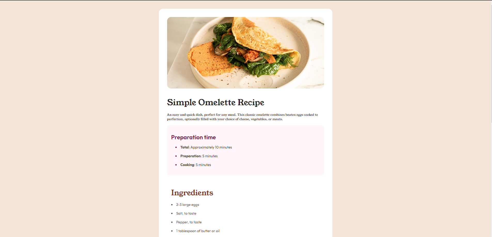
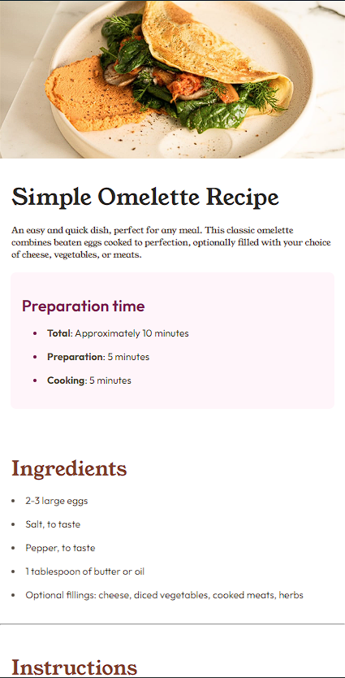

# Frontend Mentor - Recipe page solution

This is a solution to the [Recipe page challenge on Frontend Mentor](https://www.frontendmentor.io/challenges/recipe-page-KiTsR8QQKm). Frontend Mentor challenges help you improve your coding skills by building realistic projects.

## Overview

### Screenshot




### Links

- Solution URL: [Add solution URL here](https://your-solution-url.com)

## My process

### Built with

- Semantic HTML5 markup
- CSS custom properties
- Flexbox
- CSS Grid
- Mobile-first workflow

### What I learned

Usando só HTML e CSS

```html
<div class="preparation">
  <h2 class="title">Preparation time</h2>
  <ul class="list">
    <li><strong>Total</strong>: Approximately 10 minutes</li>
    <li><strong>Preparation</strong>: 5 minutes</li>
    <li><strong>Cooking</strong>: 5 minutes</li>
  </ul>
</div>
<div class="ingredients">
  <h2 class="title">Ingredients</h2>
  <ul class="list">
    <li>2-3 large eggs</li>
    <li>Salt, to taste</li>
    <li>Pepper, to taste</li>
    <li>1 tablespoon of butter or oil</li>
    <li>Optional fillings: cheese, diced vegetables, cooked meats, herbs</li>
  </ul>
</div>
```

```css
.proud-of-this-css {
  .container .omelette {
    width: 100%;
    border-radius: 1rem;
  }

  .container .text {
    margin-top: 2rem;
    display: grid;
    gap: 1rem;
    width: 100%;
    font-family: "Young Serif", sans-serif;
  }

  .container .text .title {
    font-weight: 400;
    font-size: 2rem;
    color: var(--DarkCharcoal);
  }

  .container .text .subtitle {
    font-weight: 400;
    font-size: 0.75rem;
    color: var(--WengeBrown);
  }

  .container .preparation {
    margin-top: 1rem;
    background-color: var(--RoseWhite);
    width: 100%;
    padding: 2rem 1rem;
    border-radius: 0.5rem;
  }
}
```

### Continued development

Especilizando-se em Reactjs e Web3

## Author

- Website - [Joelson Silva](https://joelson-portfollio.vercel.app/)
- Frontend Mentor - [@JoeSeraphy](https://www.frontendmentor.io/profile/JoeSeraphy)
